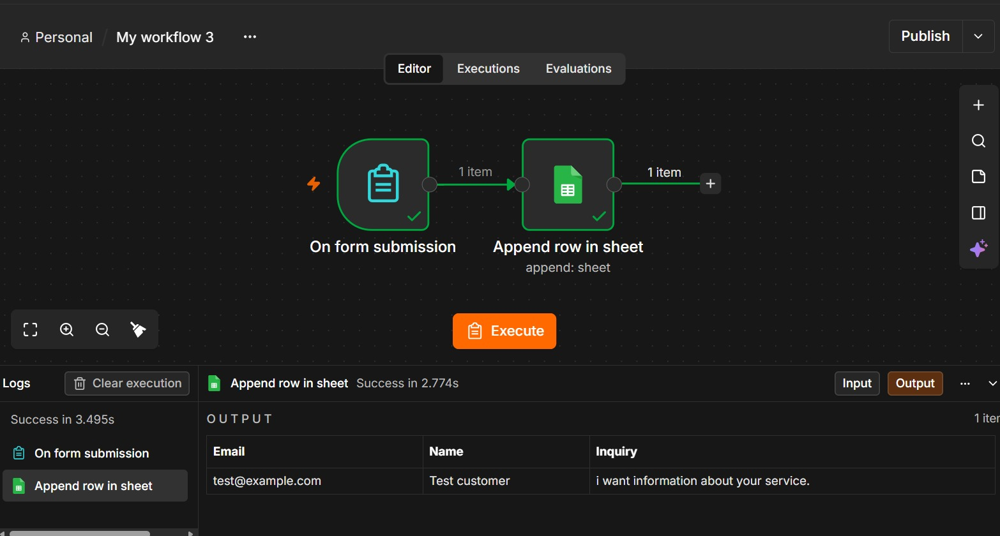
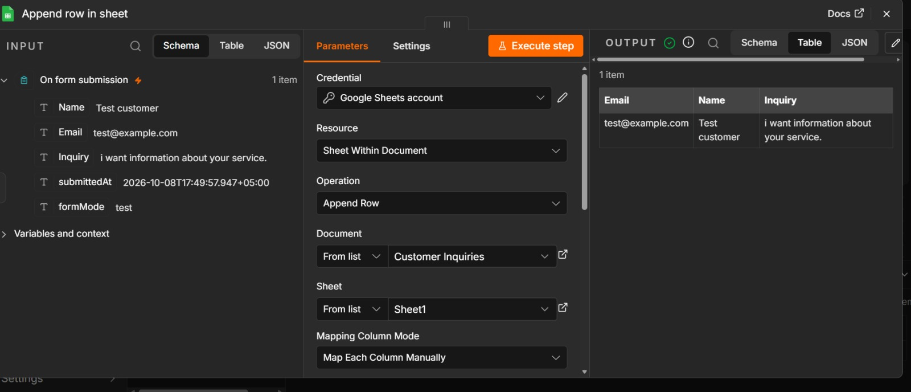
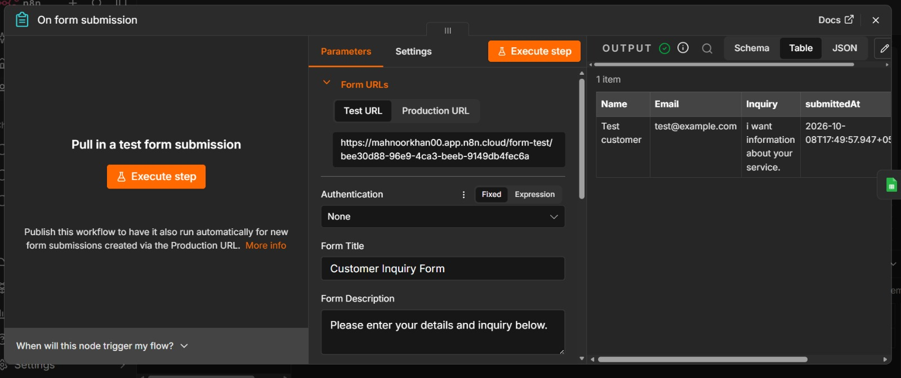

# Form to Google Sheets Automation

## What it does

This automation collects customer inquiries through an online form and automatically saves the submitted information to Google Sheets.

## Workflow

Form submission  
↓  
n8n  
↓  
Google Sheets

## Information collected

- Name
- Email
- Inquiry

## Tools used

- n8n
- Google Sheets

## Result

When a user submits the form, their information is automatically added as a new row in Google Sheets.

## Screenshots

### n8n Workflow

### Form

### Google Sheets Result

